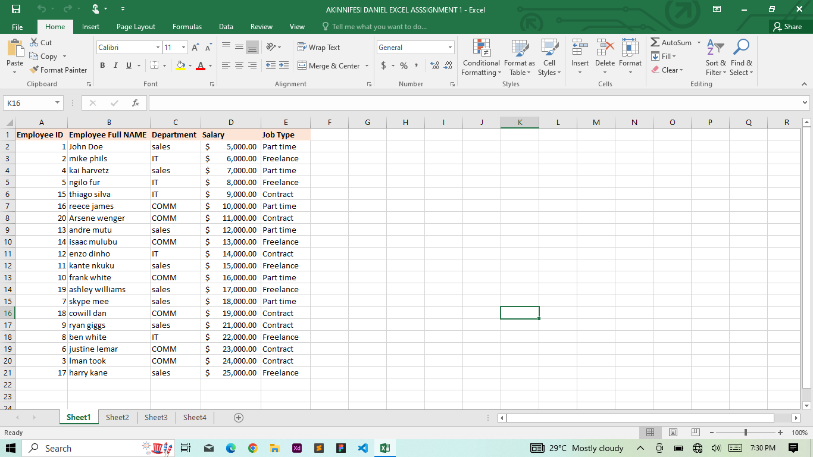
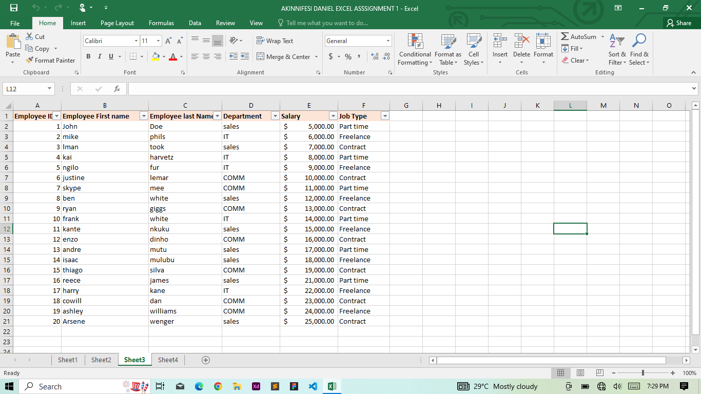
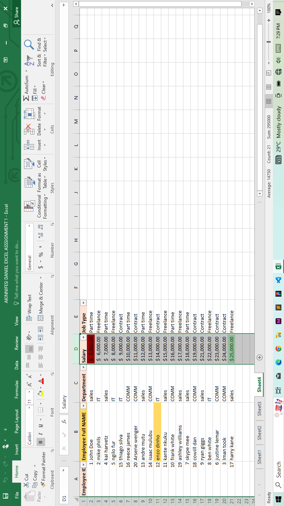

# Work_1
This is the first assigned task from the Data Analysis series by Promise Nonso

# Introduction
After a short practice task,we were tasked with our individual projects to create a table of information for our first task which consists of 20 rows and 5 columns also including the following informations:Employee ID, Employee Full Name, Department, Salary and Job Type

# Activity
- We are to show the employees who are working as freelancers and earning above $10,000
- Split the employees full names into first name and last name,and highlight the duplicate values on the tables
- Highlight employee whose names starts with E in yellow colour,and highlight the highest salary value in green and the lowest salary value in red

# Skill Implemented
- Data Manipulation
- Use of Conditional Formatting
- Use of Filters
- Text-to-Column

# Raw Data
  

# Data Manipulation
For the first activity,i applied the filter function across the headers for both the job type and salary column to show employees working as freelancers earning higher than $10,000.I also did split the full name into first name and last name for each of the employee by inserting an extra column  using the text_to_column function.Then lastly,i used the conditional formatting to highlight employees whose name starts with an E in yellow and also the employee with the highest salary in green and the lowest salary in red.

# Conclusion
it was a fun task

- 

